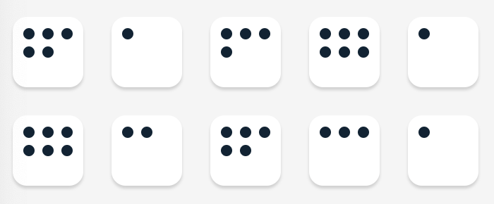
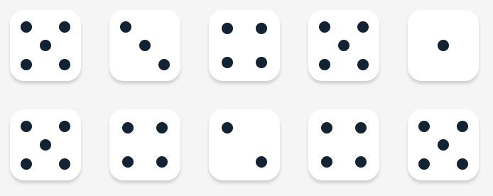

# Tenzies Game

Part of the Frontend Developer Career Path at [Scrimba](https://scrimba.com/learn/frontend).  
  
[Live](https://mchlol.github.io/tenzies/) 

## About

The first part of the game is created during the tutorial. We are then assigned some stretch goals and set on our way!  
The stretch goals are:   
- CSS: put real dots on the dice
- Track the number of rolls
- Track the time it took to win
- Save your best time to localStorage

### Track the number of rolls

The first thing to do is create a piece of state to hold the number of rolls. Then, at the top of the `rollDice()` function, `setRolls(rolls + 1)` and if the game has been won, `setRolls(0)`. Next I include a ternary before the roll button to display the number of rolls.  
If the game has been won (`tenzies` is true), show the user how many rolls they took to win, otherwise just show the number of rolls taken so far.  
`{tenzies ? <p>You won in {rolls} rolls!</p> : <p>Rolls: {rolls}</p>}` 

### CSS: put real dots on the dice

I created a new component `Dot` that renders a single `div` with some simple styling: 8px x 8px with 50% `border-radius` and a solid bg colour.  
In the `Die` component, I set up a piece of state that will hold an array based on the `props` value (a number from 1 to 6).  
I set up a `useEffect` with an empty array and a for loop that pushes a `Dot` component into the array depending on the `props` value. The components don't really need a key, but `nanoid` was provided with the project for the `Die` components so I reused this for the `Dot` components.  
Finally I put the array of `Dot` components within the die face div that is being returned from the `Die` component.  
  
*Die.js :*
```
...

    const [dieFaces, setDieFaces] = React.useState(props.value);

    React.useEffect( () => {

        let arr = [];
        for (let i = 0; i < props.value; i++) {
            arr.push(<Dot key={nanoid()}/>)
        }
        return setDieFaces(arr);
        
    }, [])


    return (
        <div 
            className="die-face" 
            style={styles}
            onClick={props.holdDice}
        >
            {dieFaces}
        </div>
    )
...
```


It worked! But, these dice don't look right.  
I started off with flexbox, and considered creating a class for each different layout for the die faces. Six different classes. It seemed like a lot of code. Plus, how to skip the blank spaces? Looking at a real dice, there are nine positions or nine 'spots' that a dot could go in, so at this point I got as far as using CSS grid to create 3 rows and 3 columns... but admittedly at a bit of a loss as to how to handle all the different layouts from here.  
I turned to Google and found this great article [Creating dice using CSS grid](https://dev.to/ekeijl/creating-dice-using-css-grid-j4) using `grid-template-areas` and the CSS selector `:nth-child`. The `grid-area` is based on the following layout.  
```
+---+---+---+
| a |   | c |
+---+---+---+
| e | g | f |
+---+---+---+
| d |   | b |
+---+---+---+
```
In CSS this translates to:  
```
grid-template-areas:
        "a . c"
        "e g f"
        "d . b";
```
We can then use the `grid-area` for each `nth-child` to decide where that will go. The last dot is positioned in the centre using some pretty clever combinator trickery.  
```
.dot:nth-child(odd):last-child {
    grid-area: g;
}
```
Wherever there are enough dots to have the last dot be an odd number it goes in the centre. E.g. one, three, five. If the number of dots is even there is no dot in the centre. Pretty cool!  

  
In the end we still have 6 selectors but it's way less CSS than I originally thought I would need. I hadn't even considered using `nth-child`! I need to brush up on my CSS selectors and definitely CSS grid.  

### Track the time it took to win

This requires two new pieces of state - the `time` in seconds, and a boolean `running` for if the timer is still running or not.  

To set a timer, I decided to use `setInterval` and increment the `timer` by 1 every 1000ms. Inside another `useEffect`, while `running` is `true` I create a `setInterval` and if `running` is false I clear it.  
The problem I had with this is that the timer never actually stopped despite what I thought was clearing it.  
After some more Googling I found this article, [Build a React Timer Component Using Hooks](https://upmostly.com/tutorials/build-a-react-timer-component-using-hooks). I needed to return a function that clears the interval when the component is rerendered.
I ended up with this:  
```
React.useEffect( () => {

        let intervalId = null;
        if (running) {
            intervalId = setInterval( () => {
                setTime(prevTime => prevTime + 1);
            }, 1000);
        } else {
            clearInterval(intervalId);
        }
        return () => clearInterval(intervalId);
        

    },[running, time]);
```
The `useEffect` runs if the `time` variable or the `running` variable have changed. Inside the `useEffect` that checks if the game is won, I set `running` to false to stop the timer.   
Under the rolls display, I included another ternary to display the timer and then show the total time when the game is over.  
`{tenzies ? <p>Your time: {time} seconds</p> : <p>Time: {time} seconds</p>}`

**Note:** I plan to change this to use [`requestAnimationFrame`](https://developer.mozilla.org/en-US/docs/Web/API/window/requestAnimationFrame) instead, so the timer will stop when the browser tab is not active.  

### Save your best time to localStorage

This requires setting up a new piece of state.  
`const [fastestTime, setFastestTime] = React.useState(localStorage.getItem('fastestTime') || null);`  
This checks `localStorage` first to see if it exists there, and if not it is set to null meaning it is intentionally empty, a value has not been set. 

Then I set up a new `useEffect` using the boolean `tenzies` as a dependency. This first checks if the game is won, if so it checks if the `fastestTime` is null and if so goes ahead and sets the new fastest time.  
If `fastestTime` is not null, it will only set the new `fastestTime` if the `time` is actually faster.  

```
    React.useEffect( () => {
        if (tenzies) {
            if (fastestTime === null) {
                setFastestTime(time);
                localStorage.setItem('storedFastestTime',time);
            } else {
                if (time < fastestTime) {
                    setFastestTime(time);
                    localStorage.setItem('storedFastestTime',time);
                } 
            }
        } 
    }, [tenzies]);
```

When the `fastestTime` is set, it is also set in localStorage so this value can persist between page loads.  


## WIP 

- use `requestAnimationFrame` instead of `setInterval` for the timer
- polish up the way the time(s) and rolls are displayed


## Resources

- [Creating dice using CSS grid](https://dev.to/ekeijl/creating-dice-using-css-grid-j4)
- [Build a React Timer Component Using Hooks](https://upmostly.com/tutorials/build-a-react-timer-component-using-hooks)


